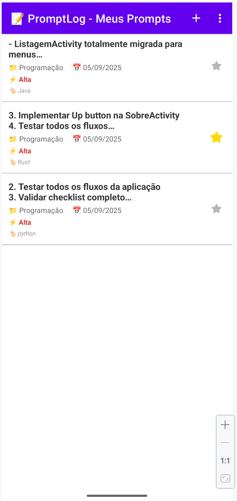
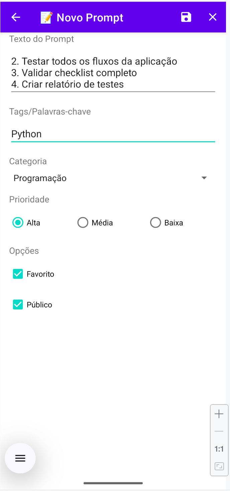
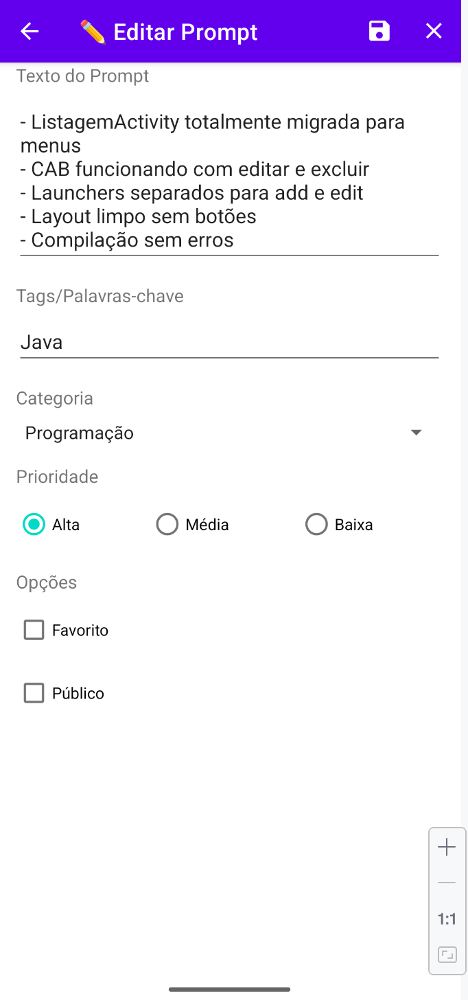
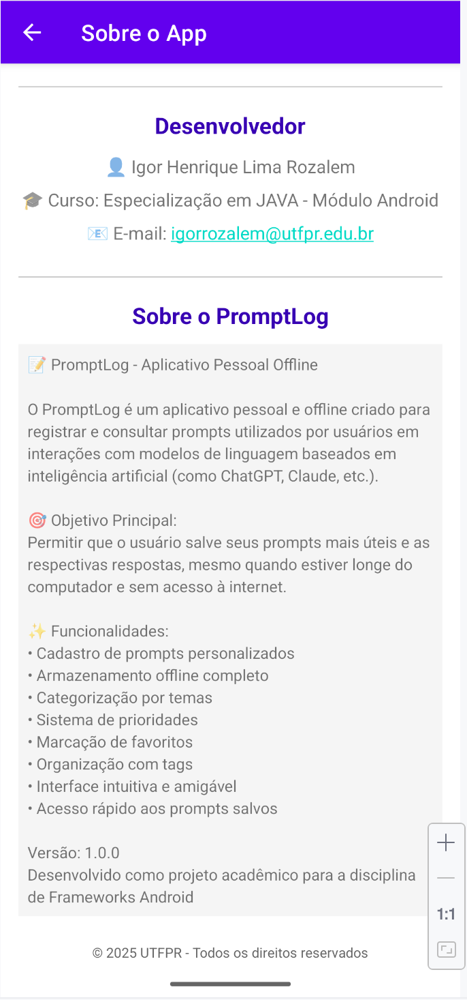

# 📝 PromptLog

<div align="center">
  
  **Sistema de Gerenciamento de Prompts para Android**
  
  [](https://developer.android.com)
  [](https://www.java.com)
  [](LICENSE)
  
  [Sobre](#-sobre) • [Funcionalidades](#-funcionalidades) • [Screenshots](#-screenshots) • [Instalação](#-instalação) • [Tecnologias](#-tecnologias) • [Estrutura](#-estrutura) • [Contribuindo](#-contribuindo)
</div>

---

## 📋 Sobre

**PromptLog** é um aplicativo Android nativo desenvolvido como projeto acadêmico para demonstrar conceitos avançados de desenvolvimento mobile, incluindo:
- Implementação de Activities e navegação
- Uso de menus e Contextual Action Bar (CAB)
- Gerenciamento de estado e ciclo de vida
- Interface responsiva com Material Design
- Padrão MVC (Model-View-Controller)

O aplicativo permite criar, visualizar, editar e excluir prompts de forma intuitiva, categorizando-os por tipo, prioridade e tags.

## ✨ Funcionalidades

### 🎯 Funcionalidades Principais
- **➕ Criar Prompts**: Adicione novos prompts com texto, categoria, prioridade e tags
- **📋 Listar Prompts**: Visualize todos os prompts cadastrados de forma organizada
- **✏️ Editar Prompts**: Modifique prompts existentes mantendo seu ID original
- **🗑️ Excluir Prompts**: Remova prompts com feedback visual imediato
- **⭐ Favoritar**: Marque prompts importantes como favoritos
- **🏷️ Categorizar**: Organize por Programação, Escrita, Design, etc.
- **🚨 Priorizar**: Defina prioridades Alta, Média ou Baixa
- **🔖 Tags**: Adicione palavras-chave para facilitar organização

### 🎨 Interface e Navegação
- **Material Design**: Interface moderna seguindo diretrizes do Google
- **Menu de Opções**: Acesso rápido às funcionalidades principais
- **Menu Contextual (CAB)**: Long press para editar/excluir
- **Navegação Intuitiva**: Up navigation e fluxo consistente
- **Feedback Visual**: Toasts informativos e estados visuais claros
- **Tema Roxo**: Visual distintivo e profissional

## 📸 Screenshots

<div align="center">
  <table>
    <tr>
      <td width="25%">
        
        <p align="center"><b>Listagem de Prompts</b></p>
      </td>
      <td width="25%">
        
        <p align="center"><b>Novo Prompt</b></p>
      </td>
      <td width="25%">
        
        <p align="center"><b>Editar Prompt</b></p>
      </td>
      <td width="25%">
        
        <p align="center"><b>Sobre o App</b></p>
      </td>
    </tr>
  </table>
</div>

### 📱 Demonstração das Funcionalidades

#### Listagem de Prompts
- Exibe todos os prompts cadastrados
- Mostra categoria, data, prioridade e tags
- Ícone de estrela para favoritos
- Long press ativa menu contextual
- Mensagem quando lista está vazia

#### Cadastro/Edição
- Campo de texto multilinha para o prompt
- Spinner dropdown para categorias
- RadioButtons para prioridade
- CheckBoxes para favorito/público
- Validação de campos obrigatórios
- Menu com ações Salvar e Limpar

## 🚀 Instalação

### Pré-requisitos
- Android Studio Arctic Fox ou superior
- JDK 11 ou superior
- Android SDK API 21+ (Android 5.0 Lollipop)
- Gradle 8.0+

### Passos para Instalação

1. **Clone o repositório**
```bash
git clone https://github.com/seu-usuario/PromptLog.git
cd PromptLog
```

2. **Abra no Android Studio**
- File → Open → Selecione a pasta do projeto
- Aguarde a sincronização do Gradle

3. **Execute o projeto**
- Conecte um dispositivo ou inicie um emulador
- Click em "Run" (▶️) ou use `Shift + F10`

### Build via Terminal
```bash
# Debug build
./gradlew assembleDebug

# Release build
./gradlew assembleRelease
```

## 🛠️ Tecnologias

### Linguagens e Frameworks
- **Java 11**: Linguagem principal
- **Android SDK**: API 21+ (Lollipop)
- **Material Components**: Biblioteca de UI
- **AndroidX**: Bibliotecas de suporte modernas

### Ferramentas de Build
- **Gradle 8.13**: Sistema de build
- **Android Gradle Plugin 8.8.0**: Plugin do Android

### Componentes Android
- **AppCompatActivity**: Base para activities
- **ActionBar**: Barra de ações superior
- **Contextual Action Mode**: Menu contextual
- **ListView**: Lista de prompts
- **ScrollView**: Scroll no formulário
- **Material Theme**: Tema visual

## 📂 Estrutura do Projeto

```
PromptLog/
├── app/
│   └── src/
│       └── main/
│           ├── java/com/promptlog/
│           │   ├── ListagemActivity.java      # Activity principal
│           │   ├── CadastroPromptActivity.java # Criar/Editar
│           │   ├── SobreActivity.java         # Informações do app
│           │   ├── adapter/
│           │   │   └── PromptAdapter.java     # Adapter customizado
│           │   └── model/
│           │       └── Prompt.java            # Modelo de dados
│           └── res/
│               ├── layout/                     # Layouts XML
│               ├── menu/                       # Menus XML
│               ├── drawable/                   # Ícones vetoriais
│               ├── values/                     # Recursos (strings, cores, etc)
│               └── mipmap/                     # Ícones do app
├── docs/
│   └── img/                                   # Screenshots do app
├── gradle/
├── .gitignore
├── build.gradle
├── settings.gradle
└── README.md
```

### 🏗️ Arquitetura

O projeto segue o padrão **MVC** (Model-View-Controller):

- **Model**: Classe `Prompt` representa os dados
- **View**: Layouts XML e componentes visuais
- **Controller**: Activities gerenciam a lógica

### 📝 Principais Classes

#### Prompt.java
```java
public class Prompt {
    private int id;
    private String texto;
    private String categoria;
    private String data;
    private String prioridade;
    private boolean favorito;
    private String tags;
    // getters e setters...
}
```

#### PromptAdapter.java
Adapter customizado que implementa o padrão ViewHolder para performance otimizada na lista.

## 🎮 Como Usar

### Criar um Novo Prompt
1. Na tela principal, clique no ícone ➕ no menu
2. Preencha o texto do prompt (obrigatório)
3. Selecione categoria e prioridade
4. Adicione tags separadas por vírgula
5. Marque como favorito se desejar
6. Clique no ícone 💾 para salvar

### Editar um Prompt
1. Na lista, faça um long press no item desejado
2. Selecione "Editar" no menu contextual
3. Modifique os campos necessários
4. Salve as alterações

### Excluir um Prompt
1. Long press no item
2. Selecione "Excluir"
3. O item será removido imediatamente

## 🤝 Contribuindo

Contribuições são bem-vindas! Para contribuir:

1. Faça um Fork do projeto
2. Crie sua Feature Branch (`git checkout -b feature/MinhaFeature`)
3. Commit suas mudanças (`git commit -m 'feat: adiciona nova funcionalidade'`)
4. Push para a Branch (`git push origin feature/MinhaFeature`)
5. Abra um Pull Request

### 📋 Convenções
- Commits seguem [Conventional Commits](https://www.conventionalcommits.org/)
- Código em Java segue convenções Android
- Nomes de recursos em snake_case
- Comentários em português

## 📄 Licença

Este projeto está sob a licença MIT. Veja o arquivo [LICENSE](LICENSE) para mais detalhes.

## 🙏 Agradecimentos

- Professor(a) da disciplina de Desenvolvimento Mobile
- Colegas de turma pelos feedbacks
- Comunidade Android pela documentação

---

<div align="center">
  Desenvolvido com ❤️ para fins acadêmicos
  
  **Entrega 4 - Menus e Navegação Profissional**
  
  📚 Curso de  ☕️[JAVA](https://www.java.com/pt-BR/) | 🏫 [[UTFPR](https://www.utfpr.edu.br)]
</div>
